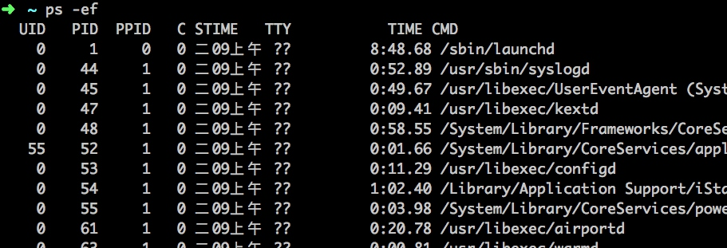
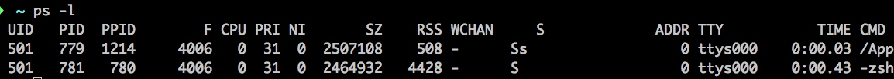

# linux-command
Linux Command Note

## 文件管理

- ls
- cd
- pwd
- cp
- mv
- rm
- mkdir
- rmdir
- cat
- diff

## 权限管理

- chmod
- chown

## 硬件管理

- df


## 系统管理

- ps

```bash
ps -ef
```



- UID 启动这些进程的用户
- PID 进程的进程号
- 父进程的进程号
- C 进程生命周期中的CPU利用率
- STIME 进程启动时的系统时间
- TTY 进程启动时的终端设备
- TIME 运行进程需要的累计CPU时间
- CMD 启动的程序名称

如果想获得更多信息可以使用`-l`
```bash
ps -l
```


- F 内核分配给进程的系统标记
- S 进程的状态
    - 0 正在运行
    - S 休眠
    - R 可运行，等待运行
    - Z 僵化，进程已结束但父进程已不存在
    - T 停止
- PRI 进程的优先级(越大的数字代表优先级越低)
- NI 谦让度 值用来参与决定优先级
- ADDR 进程的内存地址
- SZ 假如进程被换出，所需交换空间的大致大小
- WCHAN 进程休眠的内核函数地址

BSD风格的参数
- VSZ 进程在内存中的大小，以千字节kB为单位
- RSS 进程在未换初时占用的物理内存
- STAT 代表当前进程状态的双字符状态码


### Linux 参数
- PID 进程的进程号
- USER 进程属主的名字
- PR 进程的优先级
- NI 进程的谦让度值
- VIRT 进程占用的虚拟内存总量
- RES 进程占用的物理内存总量
- SHR 进程和其他进程共享的内存总量
- S 进程的状态
    - D 可中断的休眠状态
    - R 在运行状态
    - S 休眠状态
    - T 跟踪状态或停止状态
    - Z 僵化状态
- %CPU 进程使用CPU时间的比例
- ％MEM 进程使用的内存占可用内存的比例
- TIME+ 自进程启动到目前为止的CPU时间总量
- COMMAND 进程的命令行名称，也就是启动的程序名
