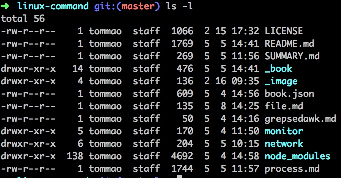

# 文件相关命令

## 相关命令

- ls
- cd
- pwd
- cp
- mv
- rm
- mkdir
- rmdir
- cat
- diff

## 文件权限

```bash
ls -l
```



## 第一列代表的含义

- `-` 代表文件
- d 代表目录
- l 代表链接
- c代表字符型设备
- b代表块设备
- n代表网络设备

## 之后3组字符，每一组三字符码代表三组访问权限
- r 代表对象是可读
- w代表对象是可写
- x代表对象是可执行的

`这三组分别代表`
- 对象的属主
- 对象的属组
- 系统其他用户

